# Exercícios sobre a programação do BIP 
## Conjunto de instruções do BIP 

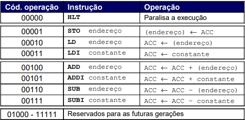

### 1. Comente cada linha dos códigos a seguir, conforme exemplificado no primeiro exercício. 

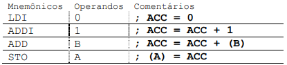

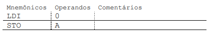
- Resposta:  ``ACC = 0``   ``(A) = ACC``

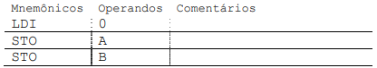
- Resposta:  ``ACC = 0``   ``(A) = ACC``   ``(B) = ACC``

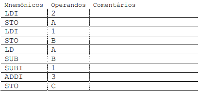
- Resposta:
 ``LDI; 2; ACC = 2`` 
 ``STO; A; (A) = ACC`` 
 ``LDI; 1; ACC = 1`` 
 ``STO; B; (B) = ACC`` 
 ``LD; A; ACC = A`` 
 ``SUB; B; ACC = ACC - B`` 
 ``SUBI; 1; ACC = ACC - 1`` 
 ``ADDI; 3; ACC = ACC + 3`` 
 ``STO; C; (C) = ACC``

### 2. Converta os códigos a seguir escritos em linguagem C para a linguagem de montagem do BIP, respeitando o estilo de codificação de programação em assembly e posicionando mnemônicos, operandos e comentários nas colunas apropriadas.

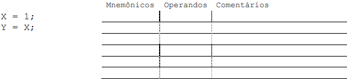
- Resposta:
  ``LDI; 1; ACC = 1``
  ``STO; X; (X) = ACC``
  ``LD; X; ACC = (X)``
  ``STO; X; (Y) = ACC``

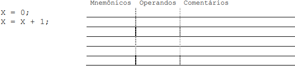
- Resposta:
 ``LDI; 0; ACC = 0``
 ``STO; X; (X) = ACC``
 ``LD; X; ACC = (X)``
 ``ADDI; 1; ACC = ACC + 1``
 ``STO; X; (X) = ACC``

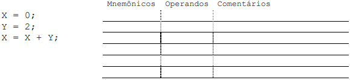
- Resposta:
 ``LDI; 0; ACC = 0``
 ``STO; X ; (X) = ACC``
 ``LDI; 2; ACC = 2``
 ``STO; Y ; (Y) = ACC``
 ``ADD; X; ACC = ACC + X``
 ``STO; X; (X) = ACC``

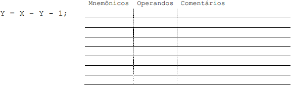
- Resposta:
 ``LDI; X; ACC = (X)``
 ``SUB; Y; ACC = ACC - Y``
 ``SUBI; 1; ACC = ACC - 1``
 ``STO; Y; (Y) = ACC``

### 3. Dados os códigos na linguagem de montagem do BIP a seguir, extraia a sua representação em linguagem C (se necessário, preencha o espaço reservado para comentários). 

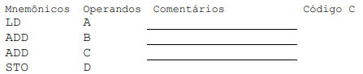
- Resposta:
 ``ACC = (A)``
 ``ACC = ACC + (B)``
 ``ACC = ACC + (C)``
 ``(D) = ACC``

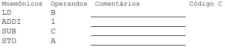
- Resposta:
 ``ACC = (B)``
 ``ACC = ACC + 1``
 ``ACC = ACC - (C)``
 ``(A) = ACC``