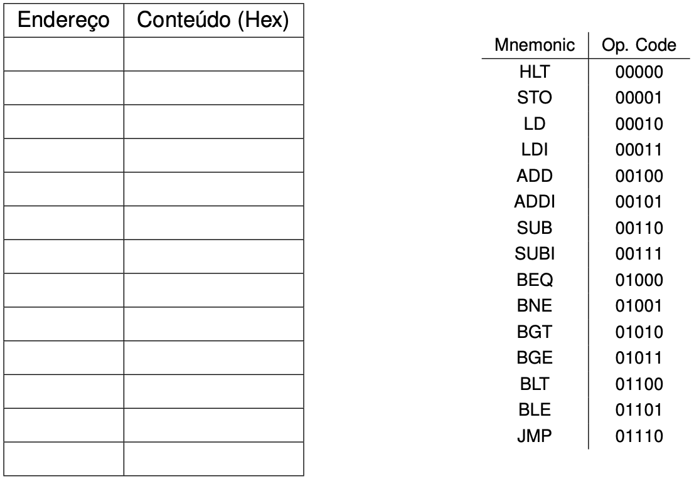
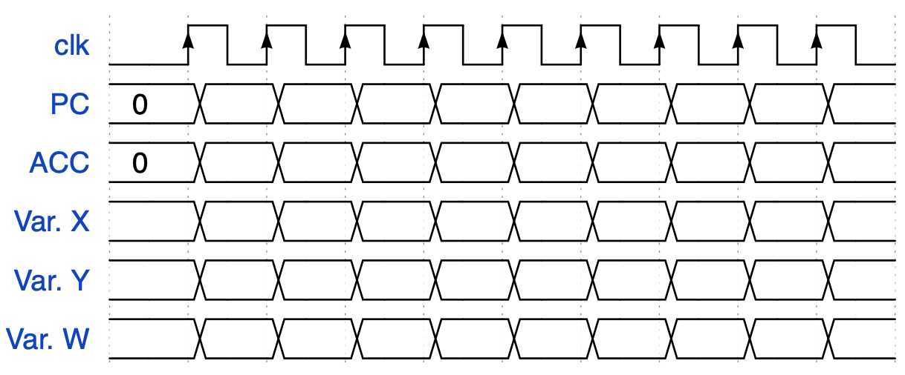

# BIP II

1. Descreva as modificações feitas na organização do BIP I para o BIP II?

- **Resposta**: No BIP II há instruções de controle de fluxo, permitindo condições, loops e rótulos ao criar um código Assembly. Também possui Flags de Status, que indica se o resultado da última operação foi zero ou negativo. Por fim, BIP II é mais flexível, permitindo programas mais complexos envolvendo endereçamentos.

2. O que significa um rótulo no código assembly?

- **Respostas**: Rótulos são marcadores de posição, que dentro desse escopo, realizam instruções específicas.

1. Considerando H, J e i variáveis de 8 bits, escreva o trecho de código abaixo utilizando o Assembly do
BIP2.

```c
if (i==3){
    H = H + 2;

} else {
    H = H + 1;
}

J = H + 1;
// Fim do programa, pare o processador
```

- **Resposta**:

```s
INIT:
    LD I
    SUBI 3
    BNE ELSE
THEN:
    LD H
    ADDI 2
    STO H
    JMP END
ELSE:
    LD H
    ADDI 1
    STO H
END:
    ADDI 1
    STO J
    HLT
```

4. Responda as questões considerando o programa abaixo para o BIP II e as seguintes características:

- Os endereços das variáveis X, Y e W são 0x3C, 0x3D e 0x3E, respectivamente.
- Os valores iniciais das variáveis X, Y e W são 5, 5 e 0, respectivamente.

```s
    LD X
    SUB Y
    BEQ EQUAL
    LDI 1
    JMP FIM
EQUAL:
    LDI 2
FIM:
    ADD X
    STO W
    HLT
```

a) Demonstre em linguagem de alto nível o que o programa Assembly está fazendo.

- **Resposta**: 
```c
if(y==x){
    w = 2 + x;
} else {
    w = 1 + x
}
```

b) Monte o programa.



- **Resposta**:

| Endereço | Conteúdo (Hex) |
|----------|----------------|
| 0        | 103C           |
| 1        | 303D           |
| 2        |                |
| 3        |                |
| 4        |                |
| 5        |                |
| 6        |                |
| 7        |                |
| 8        |                |

c) Demonstre os valores solicitados abaixo a cada ciclo de clock:



- **Resposta**:

| PC | ACC | Var. X | Var. Y | Var. W |
|----|-----|--------|--------|--------|
| 0  |     | 5      | 5      | 0      |
| 1  | 5   | 5      | 5      | 0      |
| 2  | 0   | 5      | 5      | 0      |
| 5  | 2   | 5      | 5      | 0      |
| 6  | 7   | 5      | 5      | 0      |
| 7  | 7   | 5      | 5      | 7      |
| 8  | 7   | 5      | 5      | 7      |

5. Responda as questões considerando o programa abaixo para o BIP II e as seguintes características:
- Os endereços das variáveis X, Y e W são 0x3C, 0x3D e 0x3E, respectivamente.
- Os valores iniciais das variáveis X, Y e W são 5, 5 e 0, respectivamente.

```s
    LD X
    SUB Y
    BEQ EQUAL
    LDI 1
    JMP FIM
EQUAL:
    LDI 2
FIM:
    ADD X
    STO W
    HLT

```

a) Demonstre em linguagem C o que o programa Assembly está fazendo.

- **Resposta**:
```c
if(x==y){
    w = 2 + x;
} else {
    w = 1 + x;
}
```

b) Monte o programa.

c) Demonstre os valores dos sinais de controle e dos registradores durante a execução do programa na
tabela abaixo.

- **Resposta**:

| Instrução | Opcode | PC | ACC | N | Z | WrPC | SelA1 | SelA0 | SelB | WrACC | OpSel | RdRAM | WrRAM | WrNZ | Branch |
|-----------|--------|----|-----|---|---|------|-------|-------|------|-------|-------|-------|-------|------|--------|
| LD X      |        | 1  | 5   | 0 | 0 | 1    | 0     | 0     | X    | 1     | X     | 1     | 0     | 0    | 0      |
| SUB Y     |        | 2  | 0   | 0 | 1 | 1    | 1     | 0     | 0    | 1     | 1     | 1     | 0     | 1    | 0      |
| BEQ EQUAL |        | 5  | 0   | 0 | 1 | 1    | X     | X     | X    | 0     | X     | 1     | 0     | 0    | 1      |
| LDI 2     |        | 6  | 2   | 0 | 1 | 1    | 0     | 1     | X    | 1     | X     | 1     | 0     | 0    | 0      |
| ADD X     |        | 7  | 7   | 0 | 0 | 1    | 1     | 0     | 0    | 1     | 0     | 1     | 0     | 1    | 0      |
| STO W     |        | 8  | 7   | 0 | 0 | 1    | X     | X     | Z    | 0     | X     | 0     | 1     | 0    | 0      |
| HLT       |        | 8  | 7   | 0 | 0 | 0    | X     | X     | X    | 0     | X     | 1     | 0     | 0    | 0      |
| HLT       |        | 8  |     |   |   |      |       |       |      |       |       |       |       |      |        |
| HLT       |        | 8  |     |   |   |      |       |       |      |       |       |       |       |      |        |