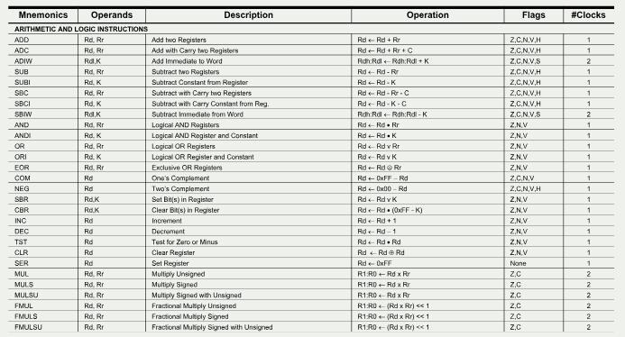
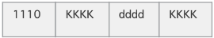

# Programando em Assembly

## 1. Pontos chave

- Planejar e modelar o código
- Conhecer a arquitetura (hierarquia de memória, periféricos, etc. )
- Conhecer as instruções assembly
- Conhecer as diretivas do montador (assembler)

## 1.1 Sintaxe do arquivo:

```asm
label:
    .EQU var1=100 ; associa a constante 100 à var1 (Diretiva)
    .EQU var2=200 ; associa a constante 200 à var2 (Diretiva)
start:
    INC r16 ; incrementa o r16 (Instrução)
    RJMP start ; salta para o rótulo ''start'' (Instrução)
```

## 1.1.2 Diretivas do Montador

- Definição do seguimento de dados ou código: `.DSEG`, `.CSEG`, `.ESEG`
- Reserva de bytes na memória SRAM (variável): `.BYTE`
- Reserva de bytes/words (constantes): `.DB`, `.DW`
- Definir um nome simbólico para um registrador: `.DEF`
- Setar um símbolo a partir de uma expressão: `.EQU`, `.SET`
- Setar um endereço de origem: `.ORG`
- Incluir um arquivo fonte: `.INCLUDE` 

## 2. Trabalhando com os registradores



## 2.1 Endereçamento Imediato (Imediato: Registrador ← Constante)

- Uma constante é carregada (load) para
um registrador.
- A constante está gravada na memória
de programa (Flash), codificada como o
operando da instrução.
- Instrução: `ldi Rd, K`
- Opcode:

- Rd ← K , onde : 16 ≤ d ≤ 31, 0 ≤ K ≤
255

Exemplo:

```asm
    ldi R16, 0x14 ; opcode = 1110 0001 0000 0100
```

## 2.1.2 Instruções Modo Imediato

- Transferência: `ldi`
- Lógica e Aritmética: `andi`, `ori`, `adiw`, `subi`, `sbci`, `sbiw`
- Desvio: `cpi`

## 2.2 Endereçamento Registrador Direto (Registrador Único)

- <instrução> Rd
<br>0 ≤ d ≤ 31

Exemplo:

```asm
INC r0
CLR r0
```

## 2.2.2 Instruções Modo Imediato

- Transferência: `push`, `pop`.
- Lógica e Aritmética: `com`, `neg`, `inc`, `dec`, `tst`, `clr`, `ser`.
- Bit e Teste de Bit: `lsl`, `lsr`, `asr`, `rol`, `ror`, `swap`, `bld`, `bst`

## 2.3 Dois Registradores

- Os operandos estão contidos nos registradores Rr e Rd. O resultado é armazenado no registro Rd.

- `mov Rd, Rr` <br>Rd ← Rr 0 ≤ r /d ≤ 31
- `movw Rd, Rr`<br> Rd + 1 : Rd ← Rr + 1 : Rr <br> r/d ∈ {0, 2, · · · , 30}

Exemplo:

```asm
INC r0
MOV r1, r0
INC r0
MOVW r2, r0
```

## 2.3.2 Instruções Dois Registradores

- Transferência: `mov`, `movw`.
- Lógica e Aritmética: `add`, `adc`, `sub`, `sbc`, `and`, `or`, `eor`, `mul`, `muls`, `mulsu`, `fmul`, `fmuls`, `fmulsu`.

## 3. Diretivas do montador

## 3.1 Diretivas .DEF e .EQU

- `.DEF` define um nome simbólico para um registrador.
- Sintaxe:
```asm
.DEF nome = registrador
```

- `.EQU` seta um símbolo a partir de uma expressão.
- Sintaxe:
```asm
.EQU label = expressão
```

Exemplo:
```asm
.DEF temp=r16
.EQU valor=0x23+5
start:
    LDI temp, valor ; inicialize o reg. temp com valor
    INC temp ; incrementa o reg. temp
    RJMP START
```

## 3.1.2 Experimento

Faça um programa que some dois números de 8 bits armazenados em registradores (`R16` e `R17`), mais uma constante (22) e copie para um terceiro registrador (R18). <br>Modifique os valores dos registradores no simulador para verificar o funcionamento.

---

# SRAM

## 1. Objetivos

- Entender os modos de endereçamento da SRAM (Direto, Indireto, Indireto com pós-incremento, pré-decremento e deslocamento)
- Entender as instruções `lds`, `sts`, `ld`, `st`, `ldd` e `std`
- Utilizar o montador de forma mais sofisticada para facilitar a codificação:
- Diretivas `.BYTE`, `.ORG`, `.DSEG`
- Operadores (+, −) e funções (`LOW()` e `HIGH()`)

## 1.2 Modos de Endereçamento: Memória de Dados

## 1.2.1 Direto

- O conteúdo de uma posição da memória de dados é acessada usando seu endereço (direto).

Exemplo:

```asm
lds R0, 0x0100
sts 0x0101, R0
```

## 1.2.2 Indireto

- O conteúdo de uma posição da memória de dados é acessada usando os ponteiros X, Y ou Z.

Exemplo:

```asm
ldi r27, 0x01 ; Byte mais significativo de X (XH)
ldi r26, 0x00 ; Byte menos significativo de X (XL)
ld r0, X      ; X est´a apontando o endere¸co 0x0100
inc r0
st X, r0
```

## 1.2.3 Indireto com Pós-Incremento

- O conteúdo de uma posição da memória de dados é acessada usando os ponteiros X, Y ou Z, e o ponteiro é incrementado após o acesso.

Exemplo:

```asm
ldi r27, 0x01 ; Byte mais significativo de X (XH)
ldi r26, 0x00 ; Byte menos significativo de X (XL)
Loop:
inc r0
st X+, r0
rjmp loop
```

## 1.2.4 Indireto com Pré-Drecremento

- O ponteiro X, Y ou Z é decrementado e depois é usado para acessar o conteúdo de uma posição da memória de dados.

Exemplo:

```asm
ldi r27, 0x01 ; Byte mais significativo de X (XH)
ldi r26, 0x0B ; Byte menos significativo de X (XL)
Loop:
inc r0
st -X, r0
rjmp loop
```

## 1.2.5 Indireto com Deslocamento

- O endereço do operando é o resultado do conteúdo do registro Y ou Z adicionado ao valor contido em seis bits da palavra de instrução. O ponteiro não sofre alteração.

Exemplo:

```asm
ldi r29, 0x01 ; Byte mais significativo de Y (YH = r29)
ldi r28, 0x00 ; Byte menos significativo de Y (YL = r28)
inc r0
std Y+2, r0   ; Y = 0x0100 "+2" = 0x0102
inc r0
std Y+3, r0   ; Y continua sendo 0x0100. Agora com + 3,
              ; a operação acontece no endereço 0x0103
```